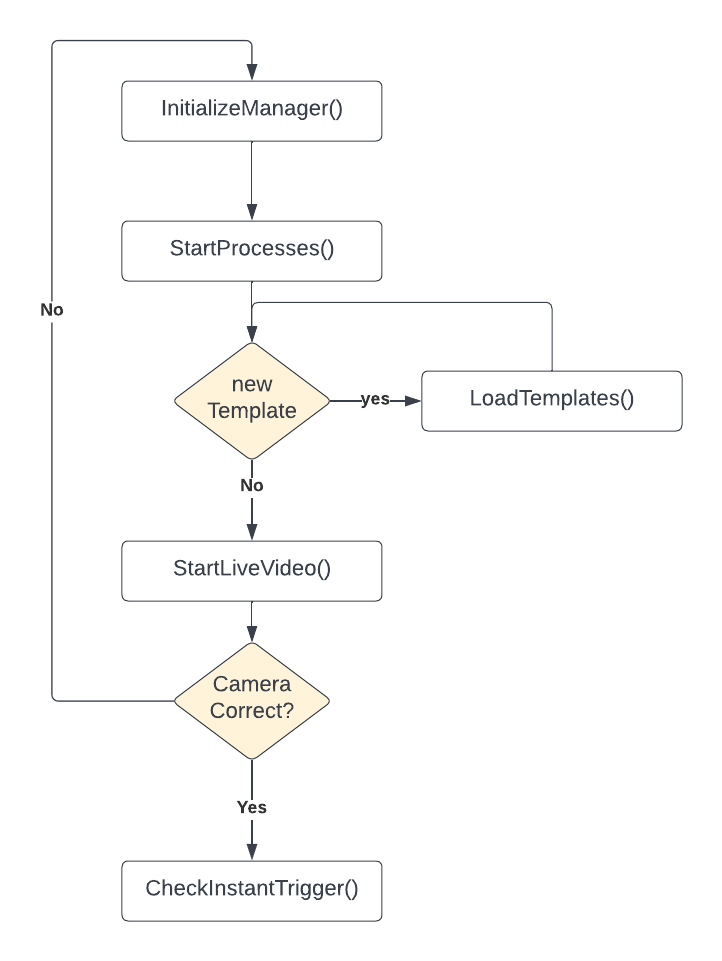

### Make sure the [Getting Started](getStart.md) has been completed
---
### Common usage

The main usage methodology of the template matching functions is to call the *checkInstantTrigger(data)* method.
This method returns the results of template matching between the current frame and the list of templates sent to the functon.

### Basic Setup

The Template matching necessitates of two things, a set of templates and a frame where to search for those frame.
The frame is actually grabbed by a USB camera (more supports comes in future releases) but the frame must be defined and placed carefully by the user.

The frame folder must be decided a priori and setted in the application by an API call

    SETTING_URL = "http://localhost:7386/api/v1/setting"

    def set_setting(name, value):
        url = f"{SETTING_URL}"
        data = {
            "name": name,
            "value": value
        }
        response = requests.post(url, json=data)
        return response.json()

    set_setting("template_folder", "PATH_TO_YOUR_TEMPLATE")

in this snipped we make an API call to the setting endpoint to set the *template_folder* path. 
 

**!!! Make sure to replate *PATH_TO_YOUR_TEMPLATE* with the correct template path folder, using slash (/) or double backslash (\\) to separate folders !!!**
 
---
Now that we have configured the template folder, we need to fill it with templates. We need to follow specific rules:
 

- format: the format must be .jpg
- size: the templte must be extracted from a frame of the same resolution used then by the camera (i.e., camera resolution 1080p, template cutted froom a frame with resolution 1920x1080)
- name: the name of the template (without its extension) will be used by the appliation and also by the user when need to chose which templates to match. (use reasonable name!)
 
 

---
### Initialization 

Before to make any function call to the actual template matching, an initialization procedure must be followed and it's as depicted in the following diagram:

where each function can be reached from the following enpoint
 

- `InitializeManager()`: **./api/v1/tm/init**

- `StartProcesses()`: **./api/v1/tm/startprocesses**

- `LoadTemplates()`: **./api/v1/tm/loadtemplate**

- `StartLiveVideo()`: **./api/v1/tm/startvideo**

- `CheckInstantTrigger()`: **./api/v1/tm/check/instant**

 

In the exemple below we follow the exact path depicted by the image.

- first we define all the methods that do API calls
- then we use the methods at the end of the snippet:
    - first initialize the manager 
    - if templates are added or removed from the template folder after manager initialization, call loadTemplates()
    - then start the multiprocess execution pool (not needed if multiprocess flag is False)
    - start a live video from camera to check if selected index is correct, if not, re-call all the previous by changing index in the initialization method.
    - Assuming that all is correct up to now, create a list of template name (without the extension .jpg) and pass to the CheckInstantTrigger() method

**N.B.** 
 
- This Snippet is a standalone snippet and `if __name__ == "__main__"` could be necessary depending on various factor
- All type and data structures definitions can be found at [API reference](api-reference.md) (redoc format) or at [FASTAPI docs](http://127.0.0.1:7386/docs) (fastapi format)

---
### Python Example

This example show a basic usage of what explained above

    import requests

    # Define the base URL for the API
    BASE_URL = "http://localhost:7386/api/v1/tm"

    # Initialize the Manager with the desired settings
    def initialize_manager():
        url = f"{BASE_URL}/init"
        data = {
            "processNumber": 4,
            "resolution": (1920, 1080),
            "multiprocess": True,
            "camIndex": 0,
            "showImage": False,
            "saveFrame": True,
            "showImageGray": False
        }
        response = requests.post(url, json=data)
        return response.json()

    # Start the Processes
    def start_processes():
        url = f"{BASE_URL}/startprocesses"
        response = requests.get(url)
        return response.json()

    # Load the Templates
    def load_templates():
        url = f"{BASE_URL}/loadtemplate"
        response = requests.get(url)
        return response.json()

    # Start Live Video
    def start_live_video():
        url = f"{BASE_URL}/startvideo"
        response = requests.get(url)
        return response.json()

    # Check Instant Trigger
    def check_instant_trigger(templates):
        url = f"{BASE_URL}/check/instant"
        data = {"templates": templates}
        response = requests.post(url, json=data)
        return response.json()

    # Example sequence of API calls following the flowchart
    if __name__ == "__main__":
        # Initialize the Manager
        init_response = initialize_manager()
        print("Initialize Manager:", init_response)

        # Decide if new templates need to be loaded based on some condition
        # This is just an example condition; replace with your actual logic
        new_template_condition = True
        
        if new_template_condition:
            # Load Templates
            load_templates_response = load_templates()
            print("Load Templates:", load_templates_response)
        
        # Start Processes
        start_processes_response = start_processes()
        print("Start Processes:", start_processes_response)
        
        # Start Live Video
        start_live_video_response = start_live_video()
        print("Start Live Video:", start_live_video_response)

        # Here you would have your logic to check if the camera is correct
        # Assuming the camera is correct, we proceed to check the instant trigger
        camera_correct = True
        
        if camera_correct:
            # Check Instant Trigger with a list of template names
            templates_to_check = ["template1", "template2"]
            check_instant_trigger_response = check_instant_trigger(templates_to_check)
            print("Check Instant Trigger:", check_instant_trigger_response)

